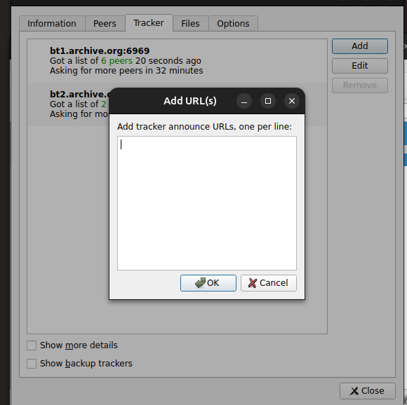
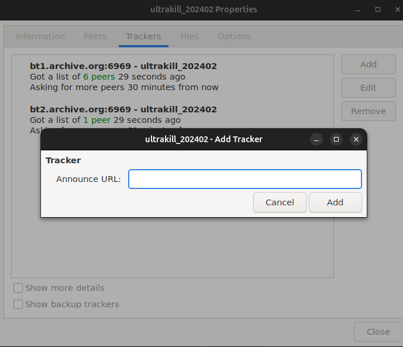

# Contribution [#1]: [1]

**Contribution Number:** 1  
**Student:** Patrick Bailon
**Issue:** https://github.com/transmission/transmission/issues/8339
**Status:** Phase 2

---

## Why I Chose This Issue

This issue is to improve on the progress bar in this repository. It was reported to be jittery and non-intuitive. This issue gives a very concrete goal and gives possible paths to work towards for this issue.
I think this contained example would allow me to focus on figuring out the basics of setting up an enviornment, reading through the codebase, and implmenting a solution that doesn't have too many intricies 
to account for when I go into testing the implementation. Due to this I believe it would give a very streamlined and managble introduction to contributing. 

---

## Understanding the Issue

### Problem description
There is a feature mismatch between different guis. In the qt version there is a text box to add several trackers at 
once, while in the gtk version you can only add one at a time.

### Expected Behavior
Both guis should have the textbox to add multiple trackers

### Current Behavior

gtk and qt differ

### Affected Components

gtk gui add tracker component.

---

## Reproduction Process

### Environment Setup

[Notes on setting up your local development environment - challenges you faced, how you solved them]

The repository did not provide a dev container, so I set up one myself. I am not using VScode and am using nvim (for the fun of it). So I had to add a few extra steps to mount my nvim workflow into the 
docker container, and had to do a few extra steps to start and enter the container using the command line. Since this is a GUI program, I wanted to test the program on all 3 interfaces it offered for linux
(Gtk, qt, and a hosting a server on a local machine) There were problems with finding the right verison of Gtk and qt that would work with Transmission. Asking claude to serach for the required versions helped a lot. However, there was additional problems after building from source.  I was unable to get the gui to render from the docker container. Asking claude about it I had to set up forwarding so it 
would display on my monitor. I didn't run into any dependencies issues and set up the container with the tools listed in the readme for the repo. 

### Steps to Reproduce

1. Open a qt instance and a gtk instance
2. Start downloading a torrent
3. While downloading click on the file and select properties. Under Tracker when you hit  

### Reproduction Evidence

- **Commit showing reproduction:** https://github.com/Einksul/transmission/tree/issue-8339
- **Screenshots/logs:** 

- **My findings:** The features are not unified.

---

## Solution Approach

### Analysis

The Gtk and Qt versions have differing logic of adding trackers for torrent files

### Proposed Solution

I will look at the logic for how Qt asks for user input for adding trackers and then adapt it to work for Gtk.

### Implementation Plan

Using UMPIRE framework (adapted):

**Understand:** The tracker logic is not unified between the Gtk and Qt version

**Match:** the Qt and the webserver version both have the correct multi-input logic. I can compare both to see the main framework that is used to implement this

**Plan:** [Step-by-step implementation plan]
1. Look at the code in DetailsDiaglog.cc in the qt directory and the backend parsing in rpcimpl.cc to see how the logic behind the tracker action and 
list editing is handled
2. adapt the code for gtk and set up the same links to the backend.
3. Test 

**Implement:** https://github.com/Einksul/transmission/tree/issue-8339

**Review:** The contribution.md file specifies coding style. Specifically to follow the C++ core guidelines and some additional preferences with headers. They also ask for good commit formatting. I will make sure that my code will abide by these guidelines and format accordingly.

**Evaluate:** The repo contains several tests. I will make sure to run all of them to make sure they pass. Then I will make gtk specific tests to see the functionality of the new feature.

---

## Testing Strategy

### Unit Tests

- [ ] Test case 1: Ensure that the textbox pops up when adding a Tracker
- [ ] Test case 2: Test whether each tracker get correctly added and show up in the gui
- [ ] Test case 3: Make sure the input gets parsed and tested correctly. Any error messages should be synced between Qt 
and Gtk

### Integration Tests

- [ ] Integration scenario 1: Make sure that the trackers are actually added in the backend
- [ ] Integration scenario 2: Make sure that switching between backup trackers is correctly handled

### Manual Testing

[What you tested manually and results]

---

## Implementation Notes

### Week [X] Progress

[What you built this week, challenges faced, decisions made]

### Week [Y] Progress

[Continue documenting as you work]

### Code Changes

- **Files modified:** [List]
- **Key commits:** [Links to important commits]
- **Approach decisions:** [Why you chose certain approaches]

---

## Pull Request

**PR Link:** [GitHub PR URL when submitted]

**PR Description:** [Draft or final PR description - much of the content above can be adapted]

**Maintainer Feedback:**
- [Date]: [Summary of feedback received]
- [Date]: [How you addressed it]

**Status:** [Awaiting review / Iterating / Approved / Merged]

---

## Learnings & Reflections

### Technical Skills Gained

[What you learned technically]

### Challenges Overcome

[What was hard and how you solved it]

### What I'd Do Differently Next Time

[Reflection on your process]

---

## Resources Used

- [Link to helpful documentation]
- [Tutorial or Stack Overflow post that helped]
- [GitHub issues or discussions that helped]
